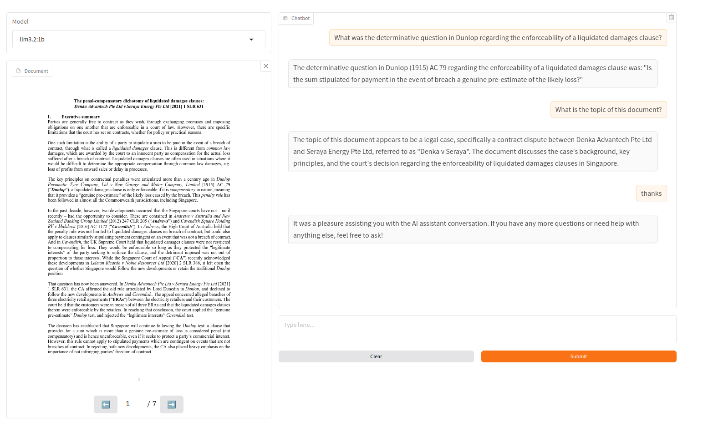

# RAG chat with PDF
This project implements a Retrieval-Augmented Generation (RAG) chatbot capable of interacting with PDF documents. It leverages **LlamaIndex** for document indexing and retrieval and **Ollama** for enhanced conversational AI capabilities.


---
### Table of Contents
1. [Features](#features-)
2. [Setup](#setup-)
    - [Build from Source](#build-from-source-)
    - [Deploy with Docker](#deploy-with-docker-)

## Features 🚀

| 🤖 Model Support                  | Implemented | Description                                             |
| --------------------------------- | ---------- | ------------------------------------------------------- |
| Ollama (e.g. Llama3)              | ✅         | Local Embedding and Generation Models powered by Ollama |
| OpenAI (e.g. GPT4)                | ✅         | Embedding and Generation Models by OpenAI               |

| 🤖 Embedding Support | Implemented | Description                              |
| -------------------- | ---------- | ---------------------------------------- |
| Ollama               | ✅         | Local Embedding Models powered by Ollama |
| OpenAI               |           | Embedding Models by OpenAI               |

| 📁 Data Support    | Implemented | Description                                   |
|--------------------|------------|-----------------------------------------------|
| PDF Ingestion      | ✅          | Import PDF                                    |
| CSV/XLSX Ingestion | planned ⏱️ | Import Table Data into Verba                  |
| .DOCX              | planned ⏱️ | Import .docx files                            |
| Multi-Modal        | planned ⏱️ | Import and Transcribe Audio through AssemblyAI |

| ✨ RAG Features        | Implemented   | Description                                                                 |
|-----------------------|---------------|-----------------------------------------------------------------------------|
| Hybrid Search         | ✅             | Semantic Search combined with Keyword Search                                |
| Router                | ✅             | Router Retriever base on your query (summary and specific contexts)         |
| Query Transformations | planned ⏱️     | Enhance retrieval by refining queries for improved relevance and accuracy.  |
| Filtering             | ✅             | Apply Filters (e.g. documents, document types etc.) before performing RAG   |
| Reranking             | ✅             | Rerank results based on context for improved results                        |
| RAG Evaluation        | ✅             | Interface for Evaluating RAG pipelines                                      |
| Agentic RAG           | out of scope ❌ | Agentic RAG pipelines                                                       |
| Graph RAG             | out of scope ❌ | Graph-based RAG pipelines                                                   |

| 🗡️ Chunking Techniques | Implemented | Description                                     |
| ---------------------- | ----------- |-------------------------------------------------|
| Sentence               | ✅          | Chunk by Sentence                               |
| Semantic               | ✅          | Chunk and group by semantic sentence similarity |

## Setup 🛠️
### Build from Source 🏗️
#### 1. Clone the repository
```
git clone https://github.com/johnPa02/local-rag-chat.git
cd local-rag-chat
```
#### 2. Install the dependencies
```
pip install poetry
poetry install
```
#### 3. Create a `.env` file in the root directory and add the following environment variables
```
cp .env.example .env
```
#### 4. Ollama
    - This project supports Ollama models. Download and Install Ollama on your device (https://ollama.com/download). Make sure to install your preferred LLM using `ollama run <model>`.
    
    Tested with `llama3`, `llama3:70b` and `mistral`. The bigger models generally perform better, but need more computational power.
    
    > Make sure Ollama Server runs in the background and that you don't ingest documents with different ollama models since their vector dimension can vary that will lead to errors
    
    You can verify that by running the following command
    
    ```
    ollama run llama3
    ```
#### 5. Run the application
- Before running the application, change the `OLLAMA_BASE_URL` in the configs.py file to `http://ollama_server:11434`
  ```
  python app.py
  ``` 
### Deploy with Docker 🐳
Run the following commands to deploy the application using Docker
```
docker-compose up --build
```